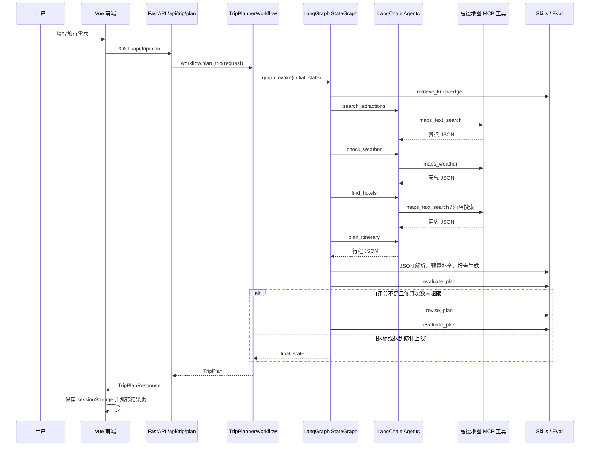

# 项目 Agent 流程实现说明

本文档说明当前项目中旅行规划 Agent 流程的真实实现。内容以现有代码为准，覆盖前端请求、FastAPI 入口、LangGraph 工作流、各 Agent 职责、RAG 检索、MCP 工具、结构化解析、评估修订、兜底计划和主要可优化点。

## 1. 总览

本项目是一个基于 FastAPI + LangGraph + LangChain Agent + 高德地图 MCP 工具的多 Agent 旅行规划系统。用户在前端填写目的地、日期、交通方式、住宿偏好、旅行偏好和补充要求后，后端会执行一个 LangGraph 状态图，把一次旅行规划拆成多个节点：

1. 检索旅行知识和用户偏好上下文。
2. 使用景点搜索 Agent 查询 POI。
3. 使用天气 Agent 查询目的地天气。
4. 使用酒店 Agent 查询住宿推荐。
5. 使用规划 Agent 汇总上下文生成结构化行程 JSON。
6. 使用评估器对行程质量打分。
7. 如分数不达标，使用确定性修订器修正行程，再重新评估。
8. 如果中间节点失败，生成一个备用计划，保证接口尽量返回可用结果。

整体架构不是单 Agent 一次性生成，而是“LangGraph 编排 + 多个专门 Agent + 可复用 Skills 后处理”的组合。

## 2. 关键代码位置

| 模块 | 文件 | 作用 |
| --- | --- | --- |
| 前端请求 | `frontend/src/views/Home.vue` | 收集表单，调用后端生成旅行计划 |
| 前端 API 封装 | `frontend/src/services/api.ts` | Axios 请求 `POST /api/trip/plan` |
| 后端路由 | `backend/app/api/routes/trip.py` | FastAPI 接口入口 |
| 工作流主逻辑 | `backend/app/workflows/trip_planner_graph.py` | LangGraph 节点、边、Agent 调用、解析和兜底 |
| 状态定义 | `backend/app/workflows/trip_planner_state.py` | `TripPlannerState`、初始状态和 reducer |
| Agent 定义 | `backend/app/agents/langgraph_agents.py` | 景点、天气、酒店、规划 Agent 的 prompt 和创建函数 |
| 评估器 | `backend/app/agents/evaluator_agent.py`、`backend/app/evals/rubric.py` | 行程评分、是否需要修订 |
| 修订器 | `backend/app/agents/reviser_agent.py` | 根据评估结果确定性修订计划 |
| MCP 工具 | `backend/app/tools/amap_mcp_tools.py` | 加载高德地图 MCP 工具、异步工具同步包装、模拟工具兜底 |
| RAG | `backend/app/rag/` | 内存知识库、检索、重排、种子知识 |
| Skills | `backend/app/skill_impls/` | JSON 提取、预算估算、行程检查、偏好匹配、报告生成 |
| 数据模型 | `backend/app/models/schemas.py` | 请求和响应 Pydantic 模型 |

## 3. 端到端数据流



## 4. 前端到后端入口

前端在 `Home.vue` 中把表单转换为 `TripFormData`：

- `city`
- `start_date`
- `end_date`
- `travel_days`
- `transportation`
- `accommodation`
- `preferences`
- `free_text_input`

然后调用 `generateTripPlan()`。`frontend/src/services/api.ts` 使用 Axios 请求：

```ts
apiClient.post<TripPlanResponse>('/api/trip/plan', formData)
```

Axios 默认后端地址为 `http://localhost:8000`，请求超时设置为 `650000ms`，用于容纳多轮 LLM 和工具调用的较长耗时。

后端路由在 `backend/app/api/routes/trip.py`：

1. 接收并校验 `TripRequest`。
2. 通过 `get_trip_planner_workflow()` 获取工作流单例。
3. 调用 `workflow.plan_trip(request)`。
4. 返回 `TripPlanResponse(success=True, data=trip_plan)`。
5. 若异常无法兜底，则抛出 HTTP 500。

## 5. 请求和响应数据结构

核心模型在 `backend/app/models/schemas.py`。

### 5.1 输入 `TripRequest`

```python
class TripRequest(BaseModel):
    city: str
    start_date: str
    end_date: str
    travel_days: int
    transportation: str
    accommodation: str
    preferences: List[str] = []
    free_text_input: Optional[str] = ""
```

其中 `travel_days` 限制为 1 到 30 天。后续所有 Agent、RAG、评估器和修订器都围绕这个请求对象工作。

### 5.2 输出 `TripPlan`

最终返回的数据是 `TripPlan`：

- `city`：目的地城市
- `start_date` / `end_date`：旅行日期
- `days`：每日行程数组
- `weather_info`：天气信息
- `overall_suggestions`：总体建议
- `budget`：预算汇总

每日行程 `DayPlan` 包含：

- `date`
- `day_index`
- `description`
- `transportation`
- `accommodation`
- `hotel`
- `attractions`
- `meals`

## 6. LangGraph 状态设计

状态类型定义在 `backend/app/workflows/trip_planner_state.py` 的 `TripPlannerState`。

这个状态对象贯穿整个 LangGraph。每个节点接收完整 state，只返回自己要更新的字段，LangGraph 负责合并。

核心字段如下：

| 字段 | 类型 | 作用 |
| --- | --- | --- |
| `request` | `TripRequest` | 原始用户请求 |
| `user_input` | `str` | 预留的自然语言输入 |
| `retrieved_city_docs` | `List[Dict]` | RAG 检索到的城市和旅行建议 |
| `retrieved_attraction_docs` | `List[Dict]` | RAG 检索到的景点知识 |
| `user_profile_context` | `Dict` | 用户偏好上下文 |
| `attractions` | `List[Attraction]` | 景点搜索 Agent 的结构化结果 |
| `weather_info` | `List[WeatherInfo]` | 天气 Agent 的结构化结果 |
| `hotels` | `List[Hotel]` | 酒店 Agent 的结构化结果 |
| `draft_plan` | `Optional[TripPlan]` | 初稿或修订中的计划 |
| `trip_plan` | `Optional[TripPlan]` | 当前可返回的计划 |
| `evaluation_result` | `Dict` | 评估器输出 |
| `revision_count` | `int` | 已修订次数 |
| `final_report` | `str` | Markdown 版旅行报告 |
| `messages` | `Annotated[List[Dict], add_messages]` | 节点消息日志，使用 LangGraph reducer 追加 |
| `error` | `Optional[str]` | 错误信息 |
| `current_step` | `Annotated[str, update_step]` | 当前执行阶段，使用自定义 reducer 覆盖为新值 |

`messages` 使用 `add_messages`，意味着每个节点返回的新消息会追加到原消息列表，而不是覆盖。`current_step` 使用自定义 `update_step(prev, new)`，始终取新步骤。

初始状态由 `create_initial_state(request)` 创建，所有列表为空，计划为空，错误为空，`revision_count=0`，`current_step="started"`。

## 7. 工作流图结构

工作流在 `TripPlannerWorkflow._build_graph()` 中构建：

```text
retrieve_knowledge
  -> search_attractions
  -> check_weather
  -> find_hotels
  -> plan_itinerary
  -> evaluate_plan
      -> revise_plan -> evaluate_plan  (条件循环)
      -> END

任一前置信息节点出错:
  -> handle_error -> END
```

更具体的边如下：

1. `retrieve_knowledge` 是入口节点。
2. `retrieve_knowledge` 后检查 `state["error"]`：
   - 无错误：进入 `search_attractions`
   - 有错误：进入 `handle_error`
3. `search_attractions` 后同样检查错误：
   - 无错误：进入 `check_weather`
   - 有错误：进入 `handle_error`
4. `check_weather` 后检查错误：
   - 无错误：进入 `find_hotels`
   - 有错误：进入 `handle_error`
5. `find_hotels` 后检查错误：
   - 无错误：进入 `plan_itinerary`
   - 有错误：进入 `handle_error`
6. `plan_itinerary` 固定进入 `evaluate_plan`。
7. `evaluate_plan` 后通过 `_should_revise()` 判断：
   - `revise`：进入 `revise_plan`
   - `finish`：结束
8. `revise_plan` 固定回到 `evaluate_plan`，形成最多 2 次的修订循环。
9. `handle_error` 直接结束。

注意：当前代码只给 `retrieve_knowledge`、`search_attractions`、`check_weather`、`find_hotels` 配置了错误条件边。`plan_itinerary` 内部如果解析失败，会调用 `_create_fallback_plan()` 返回备用计划，因此通常仍可进入评估。

## 8. 工作流初始化

`TripPlannerWorkflow.__init__()` 做四件事：

1. 调用 `get_cached_amap_tools()` 加载高德地图 MCP 工具。
2. 创建 4 个 LangChain Agent：
   - `attraction_agent`
   - `weather_agent`
   - `hotel_agent`
   - `planner_agent`
3. 创建 `TravelKnowledgeRetriever()`。
4. 调用 `_build_graph()` 编译 LangGraph。

工作流对象通过模块级变量 `_trip_planner_workflow` 实现单例。第一次请求会初始化，后续请求复用同一个工作流、工具和 Agent，降低初始化成本。

## 9. MCP 工具加载流程

工具加载代码在 `backend/app/tools/amap_mcp_tools.py`。

### 9.1 正常路径

`create_amap_mcp_tools()` 会使用 `langchain_mcp_adapters.tools.load_mcp_tools()` 启动并连接高德地图 MCP server：

```python
connection = {
    "command": "uvx",
    "args": ["amap-mcp-server"],
    "transport": "stdio",
    "env": {"AMAP_MAPS_API_KEY": settings.amap_api_key}
}
```

加载成功后，工具会作为 LangChain `BaseTool` 被传入 Agent。代码会为常见工具补充描述，例如：

- `maps_text_search`：搜索 POI，如景点、餐厅、酒店
- `maps_weather`：查询天气
- `maps_geocode`：地址转经纬度
- `maps_reverse_geocode`：经纬度转地址
- `maps_route_planning`：路线规划

### 9.2 异步工具同步包装

部分 MCP 工具只实现 `_arun`，而当前 Agent 调用链使用同步 `invoke()`。因此 `wrap_async_tools()` 会为只有异步执行能力的工具补一个同步 `_run()`，内部通过 `_run_async()` 执行 coroutine。

如果当前线程已经存在事件循环，例如 FastAPI 环境中，就用 `ThreadPoolExecutor(max_workers=1)` 在线程中运行 `asyncio.run()`，避免事件循环冲突。

### 9.3 三级兜底

`get_cached_amap_tools()` 有三层兜底：

1. 优先加载完整 MCP 工具：`get_amap_mcp_tools()`。
2. 如果失败，尝试只加载核心工具：`get_amap_essential_tools()`，主要保留 `maps_text_search` 和 `maps_weather`。
3. 如果仍失败，使用 `create_mock_tools()` 创建模拟工具。

模拟工具包含：

- `maps_text_search`
- `maps_weather`
- `maps_hotel_search`

这样即使 MCP server、依赖或 API Key 不可用，开发环境仍能跑完整流程。

## 10. LLM 服务

LLM 创建逻辑在 `backend/app/services/llm_service.py`。

`get_llm()` 返回一个全局单例 `ChatOpenAI`：

- API Key 从 `OPENAI_API_KEY` 或配置中读取。
- Base URL 从 `OPENAI_BASE_URL` 或配置中读取。
- Model 从 `OPENAI_MODEL` 或配置中读取。
- `temperature=0.7`
- `max_tokens=2000`
- `timeout=60.0`
- `max_retries=3`

项目使用的是 OpenAI 兼容接口，因此可以接入 DashScope 等兼容 OpenAI Chat Completions 协议的服务。

## 11. 四个 LLM Agent

Agent 定义在 `backend/app/agents/langgraph_agents.py`，通过 LangChain 的 `create_agent()` 创建。每个 Agent 本质上都是一个可 `invoke()` 的 Agent 图。

### 11.1 景点搜索 Agent

创建函数：`create_attraction_search_agent(tools)`

系统 prompt 角色：景点搜索专家。

主要要求：

- 必须使用工具搜索景点。
- 不允许自行编造景点信息。
- 工具调用后直接返回原始 JSON。
- 返回 JSON 应该是景点列表。

工作流节点：`_search_attractions()`

输入 query 由 `_build_attraction_query(request)` 构造：

```text
请搜索{城市}的{第一个偏好或"景点"}相关景点
```

如果 RAG 找到了景点知识，会把知识追加到 query 的“可参考的景点知识”部分。

输出解析由 `_parse_attractions()` 完成。它从 Agent 输出中提取 JSON，并转换为 `List[Attraction]`。

### 11.2 天气查询 Agent

创建函数：`create_weather_agent(tools)`

系统 prompt 角色：天气查询专家。

主要要求：

- 必须使用工具查询天气。
- 不允许编造天气。
- 返回天气 JSON 列表。

工作流节点：`_check_weather()`

输入 query：

```text
查询{城市}的天气信息
```

输出解析由 `_parse_weather()` 完成，转换为 `List[WeatherInfo]`。

`WeatherInfo` 对温度字段做了兼容处理，如果 LLM 或工具返回 `"25°C"`、`"25℃"`，Pydantic validator 会尝试转成整数。

### 11.3 酒店推荐 Agent

创建函数：`create_hotel_agent(tools)`

系统 prompt 角色：酒店推荐专家。

主要要求：

- 必须使用工具搜索酒店。
- 关键词使用“酒店”或“宾馆”。
- 工具调用后返回原始 JSON。
- JSON 应包含名称、地址、经纬度、价格范围、评分、距离、类型、预估费用。

工作流节点：`_find_hotels()`

输入 query：

```text
搜索{城市}的{住宿偏好}酒店
```

输出解析由 `_parse_hotels()` 完成，转换为 `List[Hotel]`。

### 11.4 行程规划 Agent

创建函数：`create_planner_agent([])`

这个 Agent 当前不传外部工具，职责是把前面节点结果和 RAG 上下文整理成最终行程 JSON。

系统 prompt 中写死了目标 JSON 结构，要求包括：

- 城市和日期。
- `days` 每日行程。
- 每天推荐酒店。
- 每天 2 到 3 个景点。
- 每天早中晚三餐。
- 天气信息。
- 总体建议。
- 预算信息。

工作流节点：`_plan_itinerary()`

输入由 `_build_planner_query()` 构造，包含：

- 基本旅行信息。
- 已找到景点的数量和前 3 个名称。
- 天气天数。
- 已找到酒店数量和前 2 个名称。
- RAG 检索到的城市和通用旅行知识。
- RAG 检索到的景点知识。
- 用户偏好上下文。
- 额外自由文本要求。

输出解析由 `_parse_trip_plan()` 完成，转换为 `TripPlan`。如果解析失败，会直接生成备用计划。

## 12. RAG 检索流程

RAG 实现在 `backend/app/rag/`，当前是轻量级内存检索，不依赖外部向量数据库。

### 12.1 知识库

种子知识在 `backend/app/rag/ingest.py` 的 `load_seed_knowledge()` 中，包括：

- 通用城市动线规划原则。
- 天气适配建议。
- 亲子/老人/轻松游节奏建议。
- 北京热门区域。
- 上海热门区域。
- 东京动漫与美食路线。

每条知识是一个 `TravelKnowledgeDoc`，字段包括：

- `doc_id`
- `doc_type`
- `city`
- `title`
- `content`
- `tags`
- `metadata`

### 12.2 检索器

`TravelKnowledgeRetriever.retrieve_for_request(request)` 会把以下内容拼成 query：

- 城市
- 交通方式
- 住宿偏好
- 偏好列表
- 自由文本要求

然后分别检索：

- `city` 类型：最多 4 条
- `attraction` 类型：最多 4 条
- `user_preference` 类型：最多 3 条
- `travel_tip` 类型：最多 3 条

返回结构会写入 LangGraph state：

```python
{
    "retrieved_city_docs": [...city_docs + travel_tips],
    "retrieved_attraction_docs": [...],
    "user_profile_context": {
        "preferences": request.preferences,
        "free_text_input": request.free_text_input or "",
        "retrieved_docs": [...]
    }
}
```

### 12.3 检索算法

当前 `InMemoryTravelKnowledgeStore` 使用词法匹配：

1. 用正则提取中英文 token。
2. 计算 query 和文档 token 的 overlap。
3. 如果文档城市命中请求城市，加权。
4. 如果 tag 出现在 query 中，加权。
5. 按 overlap / 文档向量范数排序。

之后 `rerank_by_city_and_preferences()` 会再次提高城市完全匹配、通用知识和偏好 tag 命中的优先级。

### 12.4 RAG 如何进入 Agent

RAG 不直接改变工具结果，而是作为 prompt 上下文注入：

- 景点知识会追加给景点搜索 Agent。
- 城市知识、景点知识、用户偏好上下文会注入给规划 Agent。

## 13. JSON 提取与结构化解析

Agent 的输出是自然语言消息，但系统希望拿到结构化对象。因此工作流有统一解析步骤。

### 13.1 提取 Agent 输出

`_extract_agent_output(result)` 支持两类返回：

1. 新版 `create_agent()` 的 `messages` 格式：从后往前找最后一个 assistant/ai 消息。
2. 旧版 `output` 字段。

如果找不到标准字段，就尝试 `text`、`response`、`content`，最后退化为 `str(result)`。

### 13.2 提取 JSON

`_extract_json()` 实际调用 `backend/app/skill_impls/repair_json.py::extract_json()`：

- 优先提取 ```json 代码块。
- 其次提取普通 ``` 代码块。
- 再从文本中寻找第一个 `{` 或 `[`，截取到最后一个对应结束符。
- 如果都找不到，返回原文本。

### 13.3 转换为 Pydantic 对象

各节点解析函数：

- `_parse_attractions()`：JSON list -> `List[Attraction]`
- `_parse_weather()`：JSON list -> `List[WeatherInfo]`
- `_parse_hotels()`：JSON list -> `List[Hotel]`
- `_parse_trip_plan()`：JSON object -> `TripPlan`

如果景点、天气、酒店解析失败，当前实现返回空列表。  
如果完整行程解析失败，当前实现直接返回 `_create_fallback_plan(request)`。

## 14. Skills 后处理

项目把一些确定性逻辑封装在 `backend/app/skill_impls/` 中，并通过 `backend/app/skills/__init__.py` 导出。

### 14.1 预算估算 `estimate_budget`

用于在行程缺少预算或预算总额无效时补全预算。

逻辑包括：

- 汇总景点门票。
- 汇总酒店 `estimated_cost`。
- 如果酒店费用为空，根据住宿偏好给默认酒店价。
- 汇总餐饮费用。
- 如果餐饮费用为空，根据天数和住宿档位估算。
- 根据交通方式估算每日交通费。

住宿档位会影响预算倍数：

- 经济/经济型：0.8
- 标准：1.0
- 舒适：1.15
- 豪华/高端：1.8

### 14.2 行程可行性检查 `check_itinerary`

用于评估行程是否过满、距离是否过远、天气是否冲突。

检查项包括：

- 每天景点数量是否过多。
- 每天总游玩时长是否过长。
- 当天景点最大两两距离是否超过 18 公里。
- 雨雪、高温、大风等天气下是否仍大量安排户外景点。

输出：

- `score`
- `issues`
- `suggestions`

### 14.3 偏好匹配 `match_preferences`

把用户偏好和自由文本要求与计划文本做简单关键词匹配。

如果用户写了“避免”“不想”“不要”“少安排”等，会抽取后续关键词作为规避项。如果计划仍出现这些关键词，会记为 mismatch。

### 14.4 报告生成 `generate_trip_report`

把最终 `TripPlan` 转成一份 Markdown 报告，写入 state 的 `final_report` 字段。当前 API 返回的是结构化 `TripPlan`，但 `final_report` 保留在工作流状态中，可用于后续扩展导出报告接口。

## 15. 评估和修订循环

规划 Agent 生成计划后，流程不会立刻结束，而是进入评估节点。

### 15.1 评估器

入口是 `backend/app/agents/evaluator_agent.py::evaluate_plan()`，实际调用 `backend/app/evals/rubric.py::evaluate_trip_plan()`。

评分维度和权重：

| 维度 | 权重 | 来源 |
| --- | ---: | --- |
| `preference_match` | 0.25 | 偏好匹配 skill |
| `geo_reasonability` | 0.25 | 距离冲突检查 |
| `time_feasibility` | 0.20 | 时间和过载检查 |
| `weather_adaptation` | 0.10 | 天气冲突检查 |
| `hotel_match` | 0.10 | 酒店/住宿匹配 |
| `schema_completeness` | 0.10 | 结构完整性 |

总分计算方式：

```python
total_score = round(
    sum(dimension_scores[name] * weight for name, weight in RUBRIC_WEIGHTS.items())
)
```

通过条件：

```python
pass = total_score >= 85 and not major_issues
```

评估结果写入 state 的 `evaluation_result`。

### 15.2 是否修订

`_should_revise(state)` 调用 `should_revise_plan(evaluation_result, revision_count)`。

修订条件：

- 没有错误。
- `revision_count < max_revisions`，默认最多 2 次。
- 评估结果未通过。
- `total_score < 85`。

如果满足条件，LangGraph 进入 `revise_plan`；否则结束。

### 15.3 修订器

修订器在 `backend/app/agents/reviser_agent.py`，是确定性逻辑，不再调用 LLM。

它根据评估问题类型修订：

- `overloaded_day` 或 `time_overload`：如果某天景点超过 3 个，截断为前 3 个，并在描述中说明已压缩。
- `weather_conflict`：在每天描述中补充天气不佳时的室内替代建议。
- 缺少三餐：自动补早餐、午餐、晚餐默认项。
- 将评估器的 `revision_instruction` 追加到 `overall_suggestions`。
- 重新估算预算。

修订后：

- 更新 `trip_plan`
- 更新 `draft_plan`
- 更新 `final_report`
- `revision_count + 1`
- 回到 `evaluate_plan`

## 16. 错误处理和备用计划

前置信息节点发生异常时，会返回：

```python
{
    "error": "...",
    "current_step": "error"
}
```

随后条件边把流程路由到 `handle_error`。

`_handle_error()` 会：

1. 读取错误信息。
2. 调用 `_create_fallback_plan(request)` 生成备用计划。
3. 调用 `generate_trip_report(fallback_plan)` 生成报告。
4. 返回 `trip_plan`、`draft_plan`、`final_report` 和错误处理消息。

备用计划特点：

- 按 `travel_days` 生成每日计划。
- 每天放 2 个模拟景点。
- 每天补早中晚三餐。
- 经纬度使用北京附近的递增模拟坐标。
- 总体建议提示用户提前查看开放时间。
- 最后仍会调用 `_apply_plan_skills()` 补预算。

如果整个图执行结束后仍有 `error` 且没有 `trip_plan`，`plan_trip()` 才会抛异常。正常情况下，`handle_error` 会提供 fallback，因此接口仍能返回成功结构。

## 17. 当前实现的 Agent 调用次数

一次正常请求通常至少包含 4 次 LLM Agent 调用：

1. 景点搜索 Agent
2. 天气查询 Agent
3. 酒店推荐 Agent
4. 行程规划 Agent

前三个 Agent 内部还可能发生多轮“LLM -> tool -> LLM”的工具调用循环，实际 LLM 调用次数取决于 LangChain `create_agent()` 的执行过程和模型是否一次选对工具。

评估器和修订器当前是确定性 Python 逻辑，不额外调用 LLM。

## 18. 当前流程的优点

1. 职责清晰：景点、天气、酒店、规划分别由不同 prompt 和节点处理。
2. 状态可追踪：所有中间结果都保存在 `TripPlannerState` 中。
3. 工具有兜底：MCP 加载失败时可以降级到核心工具或模拟工具。
4. 输出结构化：最终返回 Pydantic `TripPlan`，前端可以稳定渲染。
5. 质量闭环：规划后有评估和修订，不是一次生成就结束。
6. 可复用 Skills：预算、检查、偏好匹配、报告生成都与 LLM 解耦。
7. 可扩展：新增餐厅 Agent、路线 Agent、图片 Agent 或外部知识库时，可以作为新节点接入 LangGraph。

## 19. 当前实现的边界和风险

### 19.1 规划 Agent 只接收摘要，不接收完整中间数据

`_build_planner_query()` 当前只把景点前 3 个名称、酒店前 2 个名称和数量传给规划 Agent，而不是完整 `attractions`、`hotels`、`weather_info` JSON。

影响：

- 规划 Agent 可能无法利用完整经纬度、价格、评分等真实字段。
- 最终行程里可能出现模型补全或编造的坐标、价格和酒店信息。

更稳妥的做法是把完整结构化 JSON 压缩后注入 prompt，或让 planner 节点不再依赖 LLM 重写 POI，而是只让 LLM 选择和排序已有 POI。

### 19.2 景点、天气、酒店节点解析失败时只返回空列表

当前 `_parse_attractions()`、`_parse_weather()`、`_parse_hotels()` 解析失败会返回空列表，不一定触发 `error`。这可以保证流程继续，但也可能导致规划 Agent 在缺少真实数据时继续生成。

可以考虑：

- 空结果达到阈值时设置 warning。
- 完全空结果时重试一次。
- 解析失败时使用 `repair_and_validate_json()` 做更强修复。

### 19.3 酒店 Agent 工具选择可能不稳定

真实 MCP 工具里主要是 `maps_text_search`，模拟工具里有 `maps_hotel_search`。酒店 Agent prompt 要求使用“酒店/宾馆”关键词，但具体调用哪个工具由模型决定。

更稳妥的方式是为酒店搜索写一个确定性 wrapper tool，内部固定调用 POI 搜索并传入酒店关键词。

### 19.4 天气日期未严格对齐旅行日期

天气 Agent 查询的是城市天气，解析结果未在代码层强制对齐 `start_date` 到 `end_date`。如果工具只返回近期天气，而用户选择远期日期，最终天气信息可能不对应实际旅行日期。

### 19.5 备用计划坐标是模拟坐标

fallback 计划使用北京附近的模拟经纬度，不适合直接当作真实地图点位。它更适合作为系统可用性兜底，而不是高质量旅行结果。

### 19.6 配置中存在默认密钥

`backend/app/config.py` 中当前包含默认 API Key 配置。生产环境应改为仅从环境变量读取，并避免把密钥提交到代码仓库。

## 20. 推荐改进方向

1. 给 planner Agent 注入完整结构化上下文，而不是只注入名称摘要。
2. 增加 Route/Distance 节点，调用高德路线工具计算景点间真实距离和耗时。
3. 为餐厅搜索新增独立 Agent 或确定性工具节点。
4. 对景点、酒店和天气输出使用 Pydantic schema 强校验和自动修复。
5. 给每个节点增加 retry 策略，尤其是工具调用和 JSON 解析。
6. 引入 LangSmith tracing，方便查看每次 Agent 的 prompt、tool call 和中间消息。
7. 将 RAG 存储替换为 Chroma、FAISS 或 Milvus，支持更多城市和用户历史。
8. 暴露 `final_report` 下载或展示接口。
9. 将 fallback 计划标记为 degraded response，让前端能提示“当前为兜底方案”。
10. 删除代码中的默认密钥，只保留 `.env` 或部署环境变量。

## 21. 一句话总结

当前项目的 Agent 流程是：FastAPI 收到旅行请求后，调用一个 LangGraph 状态图；状态图先做 RAG 检索，再让景点、天气、酒店三个工具型 Agent 获取外部信息，然后让规划 Agent 生成结构化行程，随后用确定性评估器和修订器做质量闭环，最后返回 `TripPlan` 给前端。如果中途失败，则通过 fallback 计划保证接口尽量可用。
