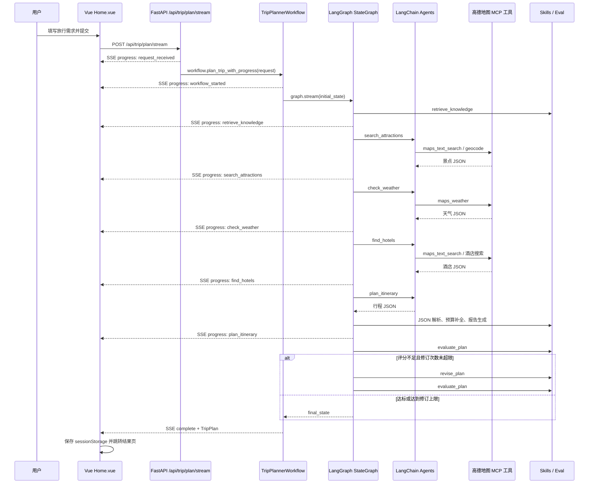

# 项目 Agent 流程实现说明

本文档按当前代码说明旅行规划 Agent 流程，覆盖前端请求、FastAPI 入口、SSE 进度、LangGraph 工作流、各 Agent 职责、RAG 检索、MCP 工具、结构化解析、评估修订和错误边界。

## 1. 总览

本项目是一个基于 FastAPI + LangGraph + LangChain Agent + 高德地图 MCP 工具的多 Agent 旅行规划系统。用户在前端填写目的地、日期、交通方式、住宿偏好、旅行偏好和补充要求后，前端默认走流式接口，后端执行一个 LangGraph 状态图：

1. 检索城市、景点、偏好和旅行建议知识。
2. 使用景点搜索 Agent 调用高德地图工具查询 POI。
3. 使用天气 Agent 查询目的地天气。
4. 使用酒店 Agent 查询住宿推荐。
5. 使用规划 Agent 汇总上下文生成结构化 `TripPlan`。
6. 应用确定性 Skills 补预算、生成 Markdown 报告。
7. 使用评估器对行程质量打分。
8. 如分数不达标，使用确定性修订器修正计划，再重新评估。
9. 前置信息节点失败时进入 `handle_error`，生成 fallback 计划。

整体架构不是单 Agent 一次性生成，而是“LangGraph 编排 + 多个专门 Agent + RAG 上下文 + 可复用 Skills 后处理”的组合。

## 2. 关键代码位置

| 模块 | 文件 | 作用 |
| --- | --- | --- |
| 前端表单 | `frontend/src/views/Home.vue` | 收集表单、展示进度条和进度日志 |
| 前端 API 封装 | `frontend/src/services/api.ts` | `streamTripPlan()` 调用 SSE；`generateTripPlan()` 调用同步接口 |
| 前端类型 | `frontend/src/types/index.ts` | `TripPlan`、`TripProgressEvent` 等类型 |
| 后端路由 | `backend/app/api/routes/trip.py` | `/plan`、`/plan/stream`、`/health` |
| 工作流主逻辑 | `backend/app/workflows/trip_planner_graph.py` | LangGraph 节点、边、进度事件、解析和兜底 |
| 状态定义 | `backend/app/workflows/trip_planner_state.py` | `TripPlannerState`、初始状态和 reducer |
| Agent 定义 | `backend/app/agents/langgraph_agents.py` | 景点、天气、酒店、规划 Agent prompt 和创建函数 |
| 评估器 | `backend/app/agents/evaluator_agent.py`、`backend/app/evals/rubric.py` | 行程评分、是否需要修订 |
| 修订器 | `backend/app/agents/reviser_agent.py` | 根据评估结果确定性修订计划 |
| MCP 工具 | `backend/app/tools/amap_mcp_tools.py` | 加载高德地图 MCP 工具、同步包装、mock 兜底 |
| RAG | `backend/app/rag/` | 内存知识库、检索、重排、种子知识 |
| Skills | `backend/app/skill_impls/` | JSON 提取、预算估算、行程检查、偏好匹配、报告生成 |
| 数据模型 | `backend/app/models/schemas.py` | 请求和响应 Pydantic 模型 |

## 3. 端到端数据流



同步接口 `/api/trip/plan` 仍然存在，它直接调用 `workflow.plan_trip(request)` 并一次性返回 `TripPlanResponse`。

## 4. 前端入口

前端首页在 `Home.vue` 中把表单转换为 `TripFormData`：

- `city`
- `start_date`
- `end_date`
- `travel_days`
- `transportation`
- `accommodation`
- `preferences`
- `free_text_input`

提交后调用：

```ts
const response = await streamTripPlan(requestData, handleProgressEvent)
```

`streamTripPlan()` 使用浏览器 `fetch()` 请求：

```ts
POST ${VITE_API_BASE_URL}/api/trip/plan/stream
Accept: text/event-stream
```

它读取 SSE 数据块，解析 `TripProgressEvent`：

- `event`: `progress` / `complete` / `error`
- `step`: 当前步骤
- `title`: 前端展示标题
- `detail`: 详细状态
- `percent`: 进度百分比
- `status`: `active` / `done` / `error`
- `data`: 完成时附带的 `TripPlan`

前端展示进度条和最近 12 条进度日志。收到 `complete` 后，把 `TripPlan` 写入 `sessionStorage` 的 `tripPlan`，再跳转 `/result`。

## 5. 后端路由入口

后端路由在 `backend/app/api/routes/trip.py`。

### 5.1 同步接口 `/api/trip/plan`

执行流程：

1. 接收并校验 `TripRequest`。
2. 通过 `get_trip_planner_workflow()` 获取工作流单例。
3. 调用 `workflow.plan_trip(request)`。
4. 返回 `TripPlanResponse(success=True, data=trip_plan)`。
5. 若异常无法兜底，则抛出 HTTP 500。

### 5.2 流式接口 `/api/trip/plan/stream`

执行流程：

1. 先发送 `request_received` 进度事件。
2. 再发送 `workflow_loading` 进度事件。
3. 获取工作流单例。
4. 遍历 `workflow.plan_trip_with_progress(request)`。
5. 每个 LangGraph 节点完成后发送一个 SSE 事件。
6. 成功时发送 `complete` 事件，`data` 为 `TripPlan.model_dump()`。
7. 失败时发送 `error` 事件。

SSE 序列化由 `_sse_event(payload)` 完成，格式是：

```text
data: {...json...}

```

## 6. 请求和响应数据结构

核心模型在 `backend/app/models/schemas.py`。

### 6.1 输入 `TripRequest`

```python
class TripRequest(BaseModel):
    city: str
    start_date: str
    end_date: str
    travel_days: int
    transportation: str
    accommodation: str
    preferences: List[str] = []
    free_text_input: Optional[str] = ""
```

`travel_days` 限制为 1 到 30 天。

### 6.2 输出 `TripPlan`

最终返回的数据是 `TripPlan`：

- `city`
- `start_date` / `end_date`
- `days`
- `weather_info`
- `overall_suggestions`
- `budget`

每日行程 `DayPlan` 包含：

- `date`
- `day_index`
- `description`
- `transportation`
- `accommodation`
- `hotel`
- `attractions`
- `meals`

景点、餐饮、酒店和天气分别由 `Attraction`、`Meal`、`Hotel`、`WeatherInfo` 表示。

## 7. LangGraph 状态设计

状态类型定义在 `backend/app/workflows/trip_planner_state.py` 的 `TripPlannerState`。每个节点接收完整 state，只返回自己要更新的字段，LangGraph 负责合并。

| 字段 | 类型 | 作用 |
| --- | --- | --- |
| `request` | `TripRequest` | 原始用户请求 |
| `user_input` | `str` | 预留自然语言输入 |
| `retrieved_city_docs` | `List[Dict]` | RAG 检索到的城市和通用旅行知识 |
| `retrieved_attraction_docs` | `List[Dict]` | RAG 检索到的景点知识 |
| `user_profile_context` | `Dict` | 用户偏好上下文 |
| `attractions` | `List[Attraction]` | 景点搜索结果 |
| `weather_info` | `List[WeatherInfo]` | 天气查询结果 |
| `hotels` | `List[Hotel]` | 酒店搜索结果 |
| `draft_plan` | `Optional[TripPlan]` | 初稿或修订中的计划 |
| `trip_plan` | `Optional[TripPlan]` | 当前可返回的计划 |
| `evaluation_result` | `Dict` | 评估器输出 |
| `revision_count` | `int` | 已修订次数 |
| `final_report` | `str` | Markdown 版旅行报告 |
| `messages` | `Annotated[List[Dict], add_messages]` | 节点消息日志，使用 LangGraph reducer 追加 |
| `error` | `Optional[str]` | 错误信息 |
| `current_step` | `Annotated[str, update_step]` | 当前执行阶段，使用自定义 reducer 覆盖为新值 |

初始状态由 `create_initial_state(request)` 创建，列表为空，计划为空，错误为空，`revision_count=0`，`current_step="started"`。

## 8. 工作流图结构

工作流在 `TripPlannerWorkflow._build_graph()` 中构建：

```text
retrieve_knowledge
  -> search_attractions
  -> check_weather
  -> find_hotels
  -> plan_itinerary
  -> evaluate_plan
      -> revise_plan -> evaluate_plan
      -> END

retrieve_knowledge / search_attractions / check_weather / find_hotels 出错:
  -> handle_error -> END
```

具体边：

1. `retrieve_knowledge` 是入口节点。
2. `retrieve_knowledge`、`search_attractions`、`check_weather`、`find_hotels` 后通过 `_check_error()` 判断继续或进入 `handle_error`。
3. `plan_itinerary` 固定进入 `evaluate_plan`。
4. `evaluate_plan` 后通过 `_should_revise()` 判断进入 `revise_plan` 或结束。
5. `revise_plan` 固定回到 `evaluate_plan`。
6. `handle_error` 直接结束。

错误边界需要特别注意：

- 景点搜索解析为空会设置 `error`，进入 `handle_error`。
- 酒店解析为空不会设置 `error`，规划节点会继续执行并要求模型补充住宿建议。
- `plan_itinerary` 中 JSON 解析失败会调用 `_create_fallback_plan()` 返回备用计划。
- `plan_itinerary` 或 `evaluate_plan` 整体异常时不会再进入 `handle_error`。如果最终没有 `trip_plan`，同步接口抛错，流式接口发送 `error` 事件。

## 9. 工作流初始化

`TripPlannerWorkflow.__init__()` 做四件事：

1. 调用 `get_cached_amap_tools()` 加载并缓存高德地图工具。
2. 创建 4 个 LangChain Agent：
   - `attraction_agent`
   - `weather_agent`
   - `hotel_agent`
   - `planner_agent`
3. 创建 `TravelKnowledgeRetriever()`。
4. 调用 `_build_graph()` 编译 LangGraph。

工作流对象通过模块级变量 `_trip_planner_workflow` 实现单例。第一次请求初始化，后续请求复用同一个工作流、工具和 Agent。

## 10. 进度事件

进度元数据定义在 `trip_planner_graph.py::PROGRESS_NODE_META`：

| 节点 | 展示标题 | 默认百分比 |
| --- | --- | ---: |
| `retrieve_knowledge` | 检索旅行知识 | 18 |
| `search_attractions` | 搜索景点 | 34 |
| `check_weather` | 查询目的地天气 | 50 |
| `find_hotels` | 搜索住宿方案 | 64 |
| `plan_itinerary` | 生成每日行程 | 80 |
| `evaluate_plan` | 评估行程质量 | 90 |
| `revise_plan` | 修订行程计划 | 94 |
| `handle_error` | 生成备用计划 | 92 |

`plan_trip_with_progress()` 使用 `graph.stream(initial_state, stream_mode="updates")` 获取真实节点更新，再用 `_progress_event_from_update()` 转成前端事件。为了避免进度倒退，代码会确保后一个事件百分比大于前一个事件，最终 `complete` 固定为 100。

## 11. MCP 工具加载流程

工具加载代码在 `backend/app/tools/amap_mcp_tools.py`。

### 11.1 正常路径

`create_amap_mcp_tools()` 使用 `langchain_mcp_adapters.tools.load_mcp_tools()` 启动并连接高德地图 MCP server：

```python
connection = {
    "command": "uvx",
    "args": ["amap-mcp-server"],
    "transport": "stdio",
    "env": {"AMAP_MAPS_API_KEY": settings.amap_api_key}
}
```

常用工具描述会被补强：

- `maps_text_search`：搜索 POI，如景点、餐厅、酒店
- `maps_weather`：查询天气
- `maps_geocode`：地址转经纬度
- `maps_reverse_geocode`：经纬度转地址
- `maps_route_planning`：路线规划

### 11.2 异步工具同步包装

部分 MCP 工具只实现 `_arun()`，而当前 Agent 调用链使用同步 `invoke()`。`wrap_async_tools()` 会为这类工具补同步 `_run()`。如果当前线程已有事件循环，就用 `ThreadPoolExecutor(max_workers=1)` 在线程里运行 `asyncio.run()`。

### 11.3 三级兜底

`get_cached_amap_tools()` 有三层兜底：

1. 优先加载完整 MCP 工具。
2. 如果失败，尝试只加载核心工具，主要是 `maps_text_search` 和 `maps_weather`。
3. 如果仍失败，使用 `create_mock_tools()` 创建模拟工具。

模拟工具包含：

- `maps_text_search`
- `maps_weather`
- `maps_hotel_search`

## 12. LLM 服务

LLM 创建逻辑在 `backend/app/services/llm_service.py`。

`get_llm()` 返回一个全局单例 `ChatOpenAI`：

- API Key 从 `OPENAI_API_KEY` 或 settings 读取。
- Base URL 从 `OPENAI_BASE_URL` 或 settings 读取。
- Model 从 `OPENAI_MODEL` 或 settings 读取。
- `temperature=settings.agent_temperature`
- `max_tokens=2000`
- `timeout=settings.agent_timeout`
- `max_retries=3`

项目使用 OpenAI 兼容接口，因此可以接入 DashScope、DeepSeek 等兼容 OpenAI Chat Completions 协议的服务。

## 13. 四个 LLM Agent

Agent 定义在 `backend/app/agents/langgraph_agents.py`，通过 LangChain 的 `create_agent()` 创建。每个 Agent 本质上都是可 `invoke()` 的 Agent 图。

### 13.1 景点搜索 Agent

创建函数：`create_attraction_search_agent(tools)`

职责：

- 必须使用工具搜索景点。
- 不允许自行编造景点信息。
- 工具调用后尽量返回原始 JSON。

工作流节点：`_search_attractions()`

输入 query 由 `_build_attraction_query(request)` 构造：

```text
请搜索{城市}的{第一个偏好或"景点"}相关景点
```

如果 RAG 找到了景点知识，会追加到 query。输出解析由 `_parse_attractions()` 完成，转换为 `List[Attraction]`。如果条目缺少坐标，会尝试调用地理编码工具补坐标；仍无坐标则跳过该景点。

### 13.2 天气查询 Agent

创建函数：`create_weather_agent(tools)`

工作流节点：`_check_weather()`

输入 query：

```text
查询{城市}的天气信息
```

输出解析由 `_parse_weather()` 完成，转换为 `List[WeatherInfo]`。`WeatherInfo` 对温度字段做了兼容处理，如果返回 `"25°C"`、`"25℃"`，Pydantic validator 会尝试转成整数。

### 13.3 酒店推荐 Agent

创建函数：`create_hotel_agent(tools)`

工作流节点：`_find_hotels()`

输入 query：

```text
搜索{城市}的{住宿偏好}酒店
```

输出解析由 `_parse_hotels()` 完成，转换为 `List[Hotel]`。如果酒店缺坐标，也会尝试地理编码补坐标。酒店为空时不会中断流程。

### 13.4 行程规划 Agent

创建函数：`create_planner_agent([])`

这个 Agent 当前不传外部工具，职责是把前面节点结果和 RAG 上下文整理成最终行程 JSON。系统 prompt 要求输出：

- 城市和日期。
- `days` 每日行程。
- 每天推荐酒店。
- 每天 2 到 3 个景点。
- 每天早中晚三餐。
- 天气信息。
- 总体建议。
- 预算信息。

工作流节点：`_plan_itinerary()`

输入由 `_build_planner_query()` 构造，包含：

- 基本旅行信息。
- 已找到景点的数量和前 3 个名称。
- 天气天数。
- 已找到酒店数量和前 2 个名称。
- RAG 检索到的城市和通用旅行知识。
- RAG 检索到的景点知识。
- 用户偏好上下文。
- 额外自由文本要求。

输出解析由 `_parse_trip_plan()` 完成，转换为 `TripPlan`。解析成功后会调用 `_apply_plan_skills()` 补预算，再调用 `generate_trip_report()` 生成 Markdown 报告。

## 14. RAG 检索流程

RAG 实现在 `backend/app/rag/`，当前是轻量级内存检索，不依赖外部向量数据库。

### 14.1 知识库

种子知识在 `backend/app/rag/ingest.py::load_seed_knowledge()` 中，包括：

- 通用城市动线规划原则。
- 天气适配建议。
- 亲子和老人旅行节奏。
- 北京热门区域。
- 上海热门区域。
- 东京动漫与美食路线。

每条知识是一个 `TravelKnowledgeDoc`，字段包括：

- `doc_id`
- `doc_type`
- `city`
- `title`
- `content`
- `tags`
- `metadata`

### 14.2 检索器

`TravelKnowledgeRetriever.retrieve_for_request(request)` 会把以下内容拼成 query：

- 城市
- 交通方式
- 住宿偏好
- 偏好列表
- 自由文本要求

然后分别检索：

- `city` 类型：最多 4 条
- `attraction` 类型：最多 4 条
- `user_preference` 类型：最多 3 条
- `travel_tip` 类型：最多 3 条

返回结构写入 LangGraph state：

```python
{
    "retrieved_city_docs": [...city_docs + travel_tips],
    "retrieved_attraction_docs": [...],
    "user_profile_context": {
        "preferences": request.preferences,
        "free_text_input": request.free_text_input or "",
        "retrieved_docs": [...]
    }
}
```

### 14.3 检索算法

`InMemoryTravelKnowledgeStore` 使用词法匹配：

1. 用正则提取中英文 token。
2. 计算 query 和文档 token 的 overlap。
3. 城市命中时加权。
4. tag 出现在 query 中时加权。
5. 按分数排序。

之后 `rerank_by_city_and_preferences()` 会再次提高城市完全匹配、通用知识和偏好 tag 命中的优先级。

### 14.4 RAG 如何进入 Agent

RAG 不直接改变工具结果，而是作为 prompt 上下文注入：

- 景点知识会追加给景点搜索 Agent。
- 城市知识、景点知识、用户偏好上下文会注入给规划 Agent。

## 15. JSON 提取与结构化解析

Agent 的输出是消息对象或自然语言文本，工作流需要把它转换为结构化对象。

### 15.1 提取 Agent 输出

`_extract_agent_output(result)` 支持：

1. 新版 `create_agent()` 的 `messages` 格式：从后往前找最后一个 assistant/ai 消息。
2. 旧版 `output` 字段。
3. `text`、`response`、`content` 等兼容字段。

### 15.2 提取 JSON

`_extract_json()` 实际调用 `backend/app/skill_impls/repair_json.py::extract_json()`：

- 优先提取标记为 json 的代码块。
- 其次提取普通代码块。
- 再从文本中寻找第一个 `{` 或 `[`，截取到最后一个对应结束符。
- 如果都找不到，返回原文本。

### 15.3 转换为 Pydantic 对象

解析函数：

- `_parse_attractions()`：JSON list -> `List[Attraction]`
- `_parse_weather()`：JSON list -> `List[WeatherInfo]`
- `_parse_hotels()`：JSON list -> `List[Hotel]`
- `_parse_trip_plan()`：JSON object -> `TripPlan`

坐标解析兼容字段包括 `location`、`坐标`、`经纬度`、`lnglat`、`lng_lat`、`point`，也兼容 `"lng,lat"` 字符串。缺坐标时，景点、酒店和计划内景点会尝试调用地理编码工具补齐。

## 16. Skills 后处理

项目把确定性逻辑封装在 `backend/app/skill_impls/` 中，并通过 `backend/app/skills/__init__.py` 导出。

### 16.1 预算估算 `estimate_budget`

用于在行程缺少预算或预算总额无效时补全预算。逻辑包括：

- 汇总景点门票。
- 汇总酒店 `estimated_cost`。
- 如果酒店费用为空，根据住宿偏好给默认酒店价。
- 汇总餐饮费用。
- 如果餐饮费用为空，根据天数和住宿档位估算。
- 根据交通方式估算每日交通费。

### 16.2 行程可行性检查 `check_itinerary`

用于评估行程是否过满、距离是否过远、天气是否冲突。检查项包括：

- 每天景点数量是否过多。
- 每天总游玩时长是否过长。
- 当天景点最大两两距离是否超过 18 公里。
- 雨雪、高温、大风等天气下是否仍大量安排户外景点。

### 16.3 偏好匹配 `match_preferences`

把用户偏好和自由文本要求与计划文本做简单关键词匹配。如果用户写了“避免”“不想”“不要”“少安排”等，会抽取后续关键词作为规避项；如果计划仍出现这些关键词，会记为 mismatch。

### 16.4 报告生成 `generate_trip_report`

把最终 `TripPlan` 转成 Markdown 报告，写入 state 的 `final_report` 字段。当前 API 返回结构化 `TripPlan`，`final_report` 保留在工作流状态中，方便后续扩展导出接口。

## 17. 评估和修订循环

规划 Agent 生成计划后，流程进入评估节点。

### 17.1 评估器

入口是 `backend/app/agents/evaluator_agent.py::evaluate_plan()`，实际调用 `backend/app/evals/rubric.py::evaluate_trip_plan()`。

评分维度和权重：

| 维度 | 权重 | 来源 |
| --- | ---: | --- |
| `preference_match` | 0.25 | 偏好匹配 skill |
| `geo_reasonability` | 0.25 | 距离冲突检查 |
| `time_feasibility` | 0.20 | 时间和过载检查 |
| `weather_adaptation` | 0.10 | 天气冲突检查 |
| `hotel_match` | 0.10 | 酒店/住宿匹配 |
| `schema_completeness` | 0.10 | 结构完整性 |

通过条件是总分不低于 85 且没有重大问题。评估结果写入 state 的 `evaluation_result`。

### 17.2 是否修订

`_should_revise(state)` 调用 `should_revise_plan(evaluation_result, revision_count)`。

修订条件：

- 没有错误。
- `revision_count < max_revisions`，默认最多 2 次。
- 评估结果未通过。
- `total_score < 85`。

满足条件时进入 `revise_plan`；否则结束。

### 17.3 修订器

修订器在 `backend/app/agents/reviser_agent.py`，是确定性逻辑，不再调用 LLM。它根据评估问题修正计划，例如补餐饮、补酒店、减少过载行程、调整与偏好冲突的安排。修订后重新生成 Markdown 报告，并回到 `evaluate_plan`。

## 18. Fallback 策略

当前 fallback 分三类：

1. **工具加载 fallback**：完整 MCP -> 核心 MCP -> mock 工具。
2. **前置信息节点 fallback**：知识检索、景点、天气、酒店节点设置 `error` 后进入 `handle_error`，生成备用计划。
3. **行程解析 fallback**：规划 Agent 返回内容无法解析为 `TripPlan` 时，`_parse_trip_plan()` 会生成备用计划。

备用计划由 `_create_fallback_plan(request)` 创建：

- 日期按 `start_date` 和 `travel_days` 生成。
- 每天 2 个占位景点。
- 每天早中晚三餐。
- 使用请求中的交通方式和住宿偏好。
- 调用 `estimate_budget()` 补预算。

## 19. 当前限制与优化方向

- Planner 当前只拿到景点和酒店摘要，不是完整候选 JSON；可改为注入完整结构化候选项，减少编造。
- 天气查询 query 只包含城市，没有显式传入旅行日期；可让工具或后处理按日期对齐。
- `plan_itinerary` 和 `evaluate_plan` 异常目前不会进入 `handle_error`；可给这些节点也接错误条件边。
- `final_report` 已生成但没有单独 API 暴露；可增加报告导出接口。
- RAG 当前是词法内存检索；后续可替换为 Chroma、FAISS 或 Milvus。
- `.env.example` 中部分 LLM 变量名仍偏旧，当前实际读取 `OPENAI_API_KEY`、`OPENAI_BASE_URL`、`OPENAI_MODEL`。
